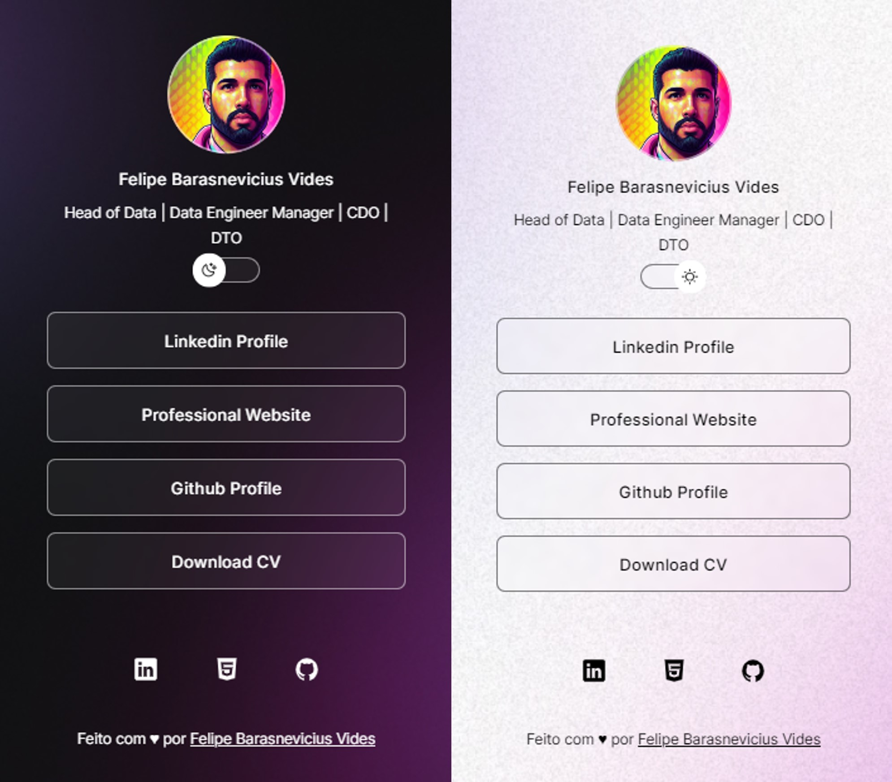

<h1 align="center"> Cartão de Visitas Online </h1>

  Agregador de links pessoais e profissionais.  

  <a href="#-tecnologias">Tecnologias</a>
  <a href="#-projeto">Projeto</a>
  <a href="#memo-licença">Licença</a>

  

 

  

## 🚀 Tecnologias

Esse projeto foi desenvolvido com as seguintes tecnologias:

- HTML e CSS
- JavaScript
- Git e Github
- Figma

## 💻 Projeto

O cartão de visitas é um agregador de links online similar ao DevLinks da Rocketseat.

- [Acesse o projeto finalizado](https://barasnevicius.github.io/agregador)

## :memo: Licença

Esse projeto está sob a licença MIT.
